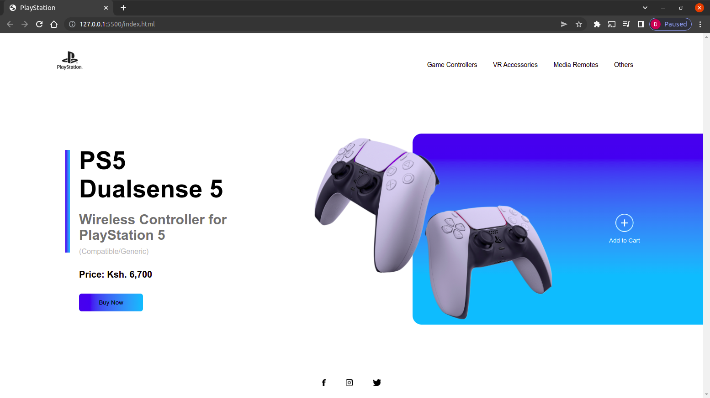

# PlayStation Landing Page
 ## By Donald Brooks Arum
## Screenshot
 
 ## Table of Content
 - [Description](#description)
 - [Features](#features)
 - [Live Link](#Live-Link)
 - [Technology  Used](#technology-Used)
 - [Licence](#licence)
 - [Authors Info](#Authors-Info)

 ## Description
 
This project is a simple responsive webpage for the Playstation 5 controller where the user can buy and interact with the Website.

 
 [Go Back to the top](#PlayStation-Landing-Page)

 ## Features
As a user of the website,you will be able to :
1. Interact with the navigation seemlessly implemented with Javascript
2. Purchase a Play Station 5 Controller going for Ksh. 6,700.
3. Responsive Website for small screens implemented using Media Queries
[Go Back to the top](#PlayStation-Landing-Page)

 ###  Requirements
 * Access to  a computer or any other gadget
 * Access to internet
 ### Installation Process
 ****
* Clone to the repo : git clone https://github.com/brooksd/playstation-landing-page.git
* Unzip the downloaded files in a folder of choice.
* Open the index file from the zipped file with any browser.
 ****
[Go Back to the top](#PlayStation-Landing-Page)

### Live Link
- Click this link to view the live application 
### Technology  Used
* HTML - The Makrup language was used in building the base structure of the webpage.
* CSS - which was used to style the HTML structure to achieve the visual result with a big emphasis on { display:flex; }.
* JavaScript - Minimal implementation on the Navigation for inter-activity
[Go Back to the top](#PlayStation-Landing-Page)

## Licence
MIT License
Copyright (c) [2022] [Donald Brooks Arum]

Permission is hereby granted, free of charge, to any person obtaining a copy
of this software and associated documentation files (the "Software"), to deal
in the Software without restriction, including without limitation the rights
to use, copy, modify, merge, publish, distribute, sublicense, and/or sell
copies of the Software, and to permit persons to whom the Software is
furnished to do so, subject to the following conditions:
The above copyright notice and this permission notice shall be included in all
copies or substantial portions of the Software.
THE SOFTWARE IS PROVIDED "AS IS", WITHOUT WARRANTY OF ANY KIND, EXPRESS OR
IMPLIED, INCLUDING BUT NOT LIMITED TO THE WARRANTIES OF MERCHANTABILITY,
FITNESS FOR A PARTICULAR PURPOSE AND NONINFRINGEMENT. IN NO EVENT SHALL THE
AUTHORS OR COPYRIGHT HOLDERS BE LIABLE FOR ANY CLAIM, DAMAGES OR OTHER
LIABILITY, WHETHER IN AN ACTION OF CONTRACT, TORT OR OTHERWISE, ARISING FROM,
OUT OF OR IN CONNECTION WITH THE SOFTWARE OR THE USE OR OTHER DEALINGS IN THE
SOFTWARE.
[Go Back to the top](#PlayStation-Landing-Page)
## Authors Info
Linkedin - [Donald Brooks Arum](https://ke.linkedin.com/in/donald-brooks-91574a188)
   
[Go Back to the top](#PlayStation-Landing-Page)